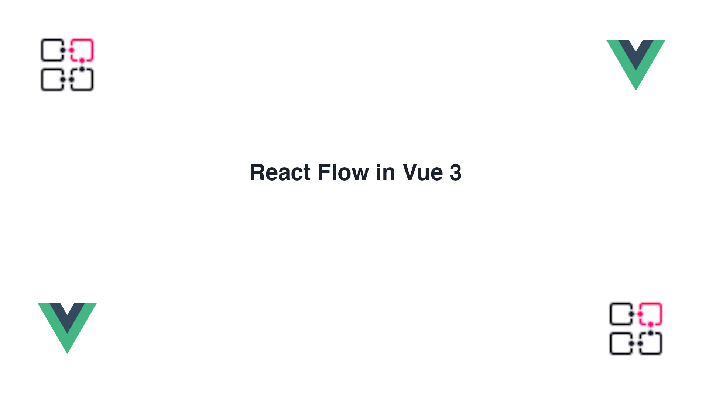

# React Flow in Vue3 = Revue Flow
[](https://md-cf-docs.vercel.app/)

[](https://david-dm.org/bcakmakoglu/revue-flow)
[](https://david-dm.org/bcakmakoglu/revue-flow?type=dev)


This repo is still a big construction site with nothing really finished.
Please check out [revue Flow](https://reactflow.dev/) if you like the idea.

### Motivation
Seeing as many libraries exist in the revue ecosystem and Vue sadly does not get the same
love and attention, I decided to port the revue Flow library to Vue.js.

## Usage
Check the React Flow docs for usage. It's really the same.

### Vue3
```bash
# install revue flow
$ yarn add @braks/revue-flow

# or
$ npm i --save @braks/revue-flow
```

### Vue2
This doesn't work with Vue2, sorry.

## Development
This project uses Vite for development and Rollup to create a distribution.

```bash
# start (dev)
$ yarn dev

# build app
$ yarn build

# serve app from build
$ yarn serve

# build dist
$ yarn build:dist
```
